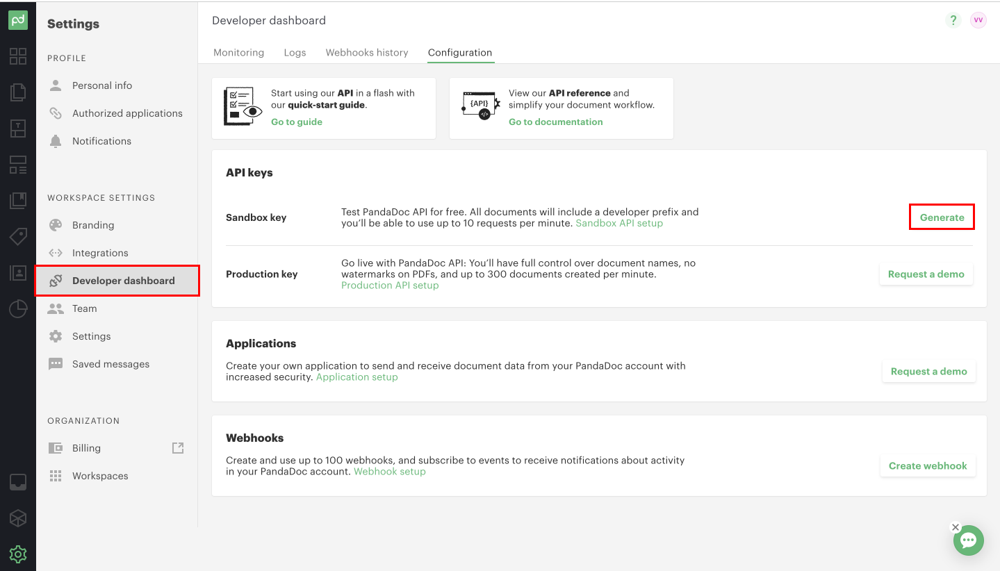
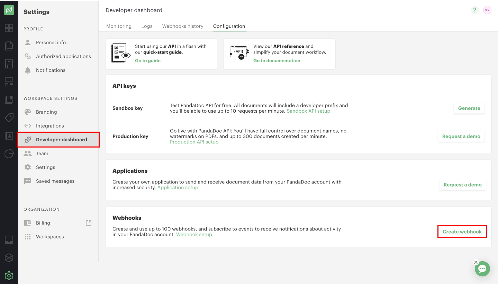
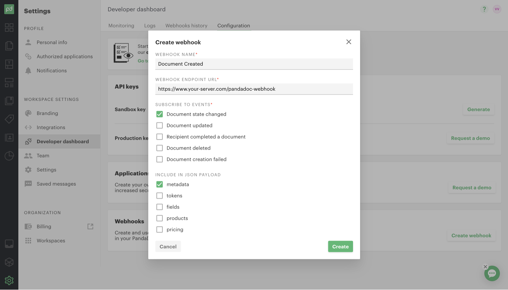
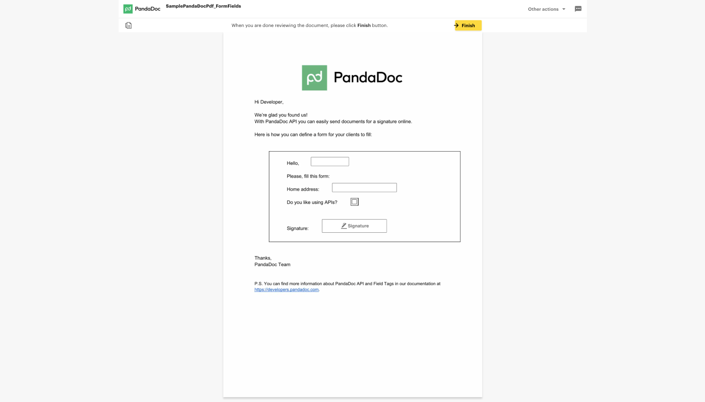

# Creating & Sending Documents Using Node.js

Node.js is a popular server framework that allows developers to use JavaScript on the backend. This means that frontend developers that are familiar with JavaScript can hop into a backend Node.js codebase and instantly feel more comfortable contributing.

In this tutorial, we’ll use Node.js to create and send PDF documents. Even better, you’ll be able to embed legal signatures into these documents using PandaDoc.

We’ll take you through this example one code snippet at a time. If you like, you can grab [all the code](https://github.com/PandaDoc/pandadoc-api-node-client/blob/main/examples/createDocumentFromPdfUrlAndSend.ts) and follow along.

## Setting Up the PandaDoc Node.js SDK

To start creating and sending PDF documents with Node.js, we will first need to install the PandaDoc client for Node.js.

First, install the Node package with npm:

```bash
npm install pandadoc-node-client
```

Or install it directly from the GitHub repository:

```bash
npm install git+https://github.com/PandaDoc/pandadoc-api-node-client.git
```

Once you have installed the PandaDoc client, you can import it into your codebase:

```js
import * as pd_api from “pandadoc-node-client”
```

### Configuring Your API Key and Verifying Set Up

To create an API Key, log into your PandaDoc account and go to the Developer Dashboard section. If you haven't created an account yet, you can do so [here](https://signup.pandadoc.com/?ss=api-dev&plan=rec_plans_v4_enterprise_an&lng=en-US):

Next, generate a sandbox key and copy it for later use.



To verify that you have set up the PandaDoc Node.js client and API key correctly, create a new node.js script called pandadoc.ts and paste in the following code with your API key. 

```js
import * as pd_api from "pandadoc-node-client";

// replace it with your API key
const API_KEY = "YOUR_API_KEY";
const configuration = pd_api.createConfiguration({
    authMethods: {
        apiKey: `API-Key ${API_KEY}`
    }
});

const apiInstance = new pd_api.TemplatesApi(configuration);

apiInstance.listTemplates({
    tag: ["doe-inc-proposals"]
}).then((data) => {
    console.log('API called successfully. Returned data: %o', data);
}).catch((error) => console.error(error));
 ```

Next, run the node script with node pandadoc.ts and verify that it runs successfully. The script will list all templates that have the “doe-inc-proposals” tag assigned to them. We don’t need to go too much more in detail about what it does since we are just verifying that the client is installed correctly.


If you have set up the client correctly, you should see the following output in your terminal:


```json
{
  "results": []
}
 ```
 
## Creating and Sending Documents with the Node.js SDK

With the PandaDoc API, you can create a document from a file or by using a Pandadoc template. In this tutorial, we will demonstrate how to create a document from a file URL.

Here are two sample file URLs you can use to test the endpoint:


- [Sample PDF with Form Fields](https://cdn2.hubspot.net/hubfs/2127247/public-templates/SamplePandaDocPdf_FormFields.pdf)
- [Sample PDF with Field Tags](https://cdn2.hubspot.net/hubfs/2127247/public-templates/SamplePandaDocPdf_FieldTags.pdf)

To create a document from a file, modify the code in the pandadoc.ts file we created earlier with the following: 

```js
import * as pd_api from "pandadoc-node-client";

// place your apiKey here
const API_KEY = "YOUR_API_KEY";
// or uncomment this if you want to setup with oauth2
// const OAUTH2_KEY = "YOUR_OAUTH_KEY";
const MAX_CHECK_RETRIES = 5;
const PDF_URL =
    "https://cdn2.hubspot.net/hubfs/2127247/public-templates/SamplePandaDocPdf_FieldTags.pdf";

async function createDocumentFromPdfUrl(
    apiInstance: pd_api.DocumentsApi
): Promise < pd_api.DocumentCreateResponse > {
    const documentCreateRequest: pd_api.DocumentCreateRequest = {
        name: "Sample Document from PDF with Field Tags",
        url: PDF_URL,
        tags: ["tag_1", "tag_2"],
        recipients: [{
                email: "josh@example.com",
                firstName: "Josh",
                lastName: "Ron",
                role: "user",
                signingOrder: 1,
            },
            {
                email: "john@example.com",
                firstName: "John",
                lastName: "Doe",
                signingOrder: 2,
            },
        ],
        fields: {
            name: {
                value: "John",
                role: "user"
            },
            like: {
                value: true,
                role: "user"
            },
        },
        metadata: {
            "salesforce.opportunity_id": "123456",
            "my_favorite_pet": "Panda",
        },
        parseFormFields: false,
    };

    return await apiInstance.createDocument({
        documentCreateRequest: documentCreateRequest,
    });
}


async function runExample(): Promise < void > {
    let configuration = pd_api.createConfiguration({
        authMethods: {
            apiKey: `API-Key ${API_KEY}`, // or authMethods: {oauth2: `Bearer ${OAUTH2_KEY}`}
        },
        baseServer: new pd_api.ServerConfiguration(
            "https://api.pandadoc.com", {}
        ),
    });
    const apiInstance = new pd_api.DocumentsApi(configuration);

    try {
        let createdDocument = await createDocumentFromPdfUrl(apiInstance);
        console.log("Document was successfully uploaded: %o", createdDocument);
        // we will uncomment the next 3 lines in the following sections
        // await ensureDocumentCreated(apiInstance, createdDocument);
        // await sendDocument(apiInstance, createdDocument);
        // console.log("Document was successfully created and sent to the recipients!");
    } catch (e) {
        if (e instanceof pd_api.ApiException) {
            console.log(e.message);
        } else {
            throw e;
        }
    }
}

runExample();
 ```
 
If you successfully run the pandadoc.ts script with node pandadoc.ts, you will see the following output:

Document was successfully uploaded:
```json
{
  "date_created": "20XX-XX-XXXX",
  "date_modified": "20XX-XX-XXXX",
  "expiration_date": null,
  "id": "abcdefgh1234567890",
  "info_message": "You need to poll the Document Status method until the status will be changed to document.draft",
  "links": [
    {
      "href": "https://api.pandadoc.com/public/v1/documents/abcdefgh1234567890",
      "rel": "status",
      "type": "GET"
    }
  ],
  "name": "[DEV] Sample Document from PDF with Field Tags",
  "status": "document.uploaded",
  "uuid": "abcdefgh1234567890",
  "version": null
}
 ```

With this code, we create a new document using the **apiInstance.createDocument** endpoint. We pass in an object that follows the **DocumentCreateRequest** object schema that we imported from the API. This object schema has the following fields:
- name
- url
- tags
- recipients
- fields
- metadata
- parse_form_fields

The *url* field is the URL of the PDF file we are using. The *recipients* field takes in an array of recipient objects. A recipient object should look like this:
```js
{
        email: "josh@example.com",
        firstName: "Josh",
        lastName: "Ron",
        role: "user",
        signingOrder: 1,
}
```
We store the result of the **createDocumentFromPdfUrl(apiInstance)** in the *createdDocument* variable, which we will use later to check on the document status and send the document.


### Getting Documents’ Status with the status_document Endpoint

Since the **createDocument** endpoint is asynchronous, we need to check that the document was actually created successfully before we send it.

To do so, we can create the following method in **pandadoc.ts** to check the status of the document with the **apiInstance.statusDocument** endpoint:


```js
async function ensureDocumentCreated(
    apiInstance: pd_api.DocumentsApi,
    document: pd_api.DocumentCreateResponse
): Promise < void > {
    /*
      Document creation is a non-blocking (asynchronous) operation.

      With a successful request, you receive a response with the created
      document's ID and status document.uploaded.
      After processing completes on our servers, usually a few seconds,
      the document moves to the document.draft status.
      Please wait for the webhook call or check this document's
      status before proceeding.

      The change of status from document.uploaded to another status signifies
      the document is ready for further processing.
      Attempting to use a newly created document before PandaDoc servers
      process it will result in a '404 document not found' response.
       */

    let retries = 0;

    while (retries < MAX_CHECK_RETRIES) {
        await new Promise((r) => setTimeout(r, 2000));
        retries++;

        let response = await apiInstance.statusDocument({
            id: String(document.id),
        });

        if (response.status === "document.draft") {
            return;
        }
    }

    throw Error("The document was not processed yet");
}
```

Afterwards, we can uncomment the **ensureDocumentCreated** method in the **runExample()** method of **pandadoc.ts**.

Try running the **pandadoc.ts** file again with *node pandadoc.ts*.

If your document was never created, you should see “Document was not sent” in your terminal. Otherwise, your document has been successfully created.


### Sending Documents with the Node.js SDK

Now that we’ve verified that our document was created, we can send the document to our recipients. To do this, add the **sendDocument** method to the **pandadoc.ts** file. Be sure to also uncomment the **sendDocument** method call and print statement in the **runExample()** method. 

```js
async function sendDocument(
    apiInstance: pd_api.DocumentsApi,
    document: pd_api.DocumentCreateResponse
): Promise < void > {
    await apiInstance.sendDocument({
        id: String(document.id),
        documentSendRequest: {
            silent: false,
            subject: "Sent via Node SDK",
            message: "This document was sent via Node SDK example",
        },
    });
}
```

Try running the **pandadoc.ts** file again with *node pandadoc.ts*. If it is successful, you should see the following output to your terminal: “Document was successfully created and sent to recipients!”

## Setting Up Webhooks to Handle Documents

In our example, we poll to see if the document’s status has changed to document.draft, and after five attempts we throw an error message. In a production environment, this isn’t a good way to check if a document was successfully created.

Instead, we recommend setting up a webhook to listen to changes in your document status and to handle the document accordingly once the status changes.

You can create a webhook by going to your PandaDoc dashboard and selecting “Create webhook” at the very bottom.



Afterwards, subscribe to “Document state changed” events and check the box to include metadata. 



### Handling the Webhook Payload in Your Webhook Endpoint 

You will also need to provide a webhook endpoint URL, which should be hosted on your own server. The endpoint should receive a payload whenever a document changes status, and it should handle the payload accordingly.

Webhook data is in the form of an array, and it may contain a few notification objects at the same time. Basic information and *recipient* are always returned. Additionally, *fields*, *tokens*, *products*, and *pricing* can be configured in webhook settings.

To make sure requests are valid and not spoofed, you can provide webhook verification by providing your own shared key and signature. 

For more information about webhook events or webhook verification, [read the PandaDoc webook documentation](https://developers.pandadoc.com/reference/on-document-status-change#webhooks-verification).

## Sharing Documents with the Node.js SDK

### Creating a Document Link

We will often want to create a link  to our document that we can send to our recipients. This way, we can embed the link in an email or an internal page so that our recipients can click on it.

To create a document link in Node.js, we will need to call the **createDocumentLink** method and pass in a **DocumentsApiCreateDocumentLinkRequest** object. This object will include the document ID and recipient emails, as well as a duration specifying how long the link will be active.

```js
import * as pd_api from 'pandadoc-node-client';

// replace it with your API key
const API_KEY = "YOUR_API_KEY";
const configuration = pd_api.createConfiguration({
    authMethods: {
        apiKey: `API-Key ${API_KEY}`
    }
});
const apiInstance = new pd_api.DocumentsApi(configuration);

const body: pd_api.DocumentsApiCreateDocumentLinkRequest = {
    // string | Document ID
    id: "ZPeAfcpzr9aiVs5vqUf6jg",
    // DocumentCreateLinkRequest
    documentCreateLinkRequest: {
        recipient: "josh@example.com",
        lifetime: 7200, //the number of seconds before the link expires
    },
};

apiInstance.createDocumentLink(body).then((data) => {
    console.log('API called successfully. Returned data: %o', data);
}).catch((error) => console.error(error));
```

To learn more about creating a link, check out the [API documentation](https://developers.pandadoc.com/reference/link-to-a-document) and the [Github examples](https://github.com/PandaDoc/pandadoc-api-python-client/blob/main/docs/DocumentsApi.md#create_document_link).

### Creating a View Session

If you want to embed your document link in an iframe so that you can have it on your own webpage, you can do so with a view session.

To create an iframe with your document link embedded, copy the following code, using your document link as the URL. Be sure to use the id from the createDocumentLink request.

```html
<iframe src="https://app.pandadoc.com/s/{sessionId}"></iframe>
```



To learn more about creating a view session, check out the [API Documentation](https://developers.pandadoc.com/reference/embed-a-document).

### Linking a new document to your CRM

If you want to link your new document to your CRM of choice, you can also do it with the Node.js SDK.

To create a linked document, we will need to call the **createLinkedObject** method and pass in a **DocumentsApiCreateLinkedObjectRequest** object. This object will include the document id, CRM provider, entity type, and entity id.


```js
import * as pd_api from 'pandadoc-node-client';

const API_KEY = "YOUR_API_KEY";
const configuration = pd_api.createConfiguration({
    authMethods: {
        apiKey: `API-Key ${API_KEY}`
    }
});
const apiInstance = new pd_api.DocumentsApi(configuration);

const body: pd_api.DocumentsApiCreateLinkedObjectRequest = {
    // string | Specify document ID.
    id: "ZPeAfcpzr9aiVs5vqUf6jg",
    // LinkedObjectCreateRequest
    linkedObjectCreateRequest: {
        provider: "pipedrive",
        entityType: "deal",
        entityId: "9372",
    },
};

apiInstance.createLinkedObject(body).then((data) => {
    console.log('API called successfully. Returned data: %o', data);
}).catch((error) => console.error(error));
```

To learn more about linking documents to CRMs, check out the [API Documentation](https://developers.pandadoc.com/reference/link-to-crm-2) or the [Github examples](https://github.com/PandaDoc/pandadoc-api-python-client/blob/main/docs/DocumentsApi.md#create_linked_object).

## Additional Resources
Here is a list of additional resources that may be helpful to view as you continue using PandaDoc:

- [PandaDoc API Reference](https://developers.pandadoc.com/reference/about)
- [Create Document API](https://developers.pandadoc.com/reference/new-document)
- [Send Document API](https://developers.pandadoc.com/reference/send-document)
- [Share Document API](https://developers.pandadoc.com/reference/share-document)
- [Create Linked Object API](https://developers.pandadoc.com/reference/link-to-crm-2)
- [Webhooks Documentation](https://developers.pandadoc.com/reference/on-document-status-change)

